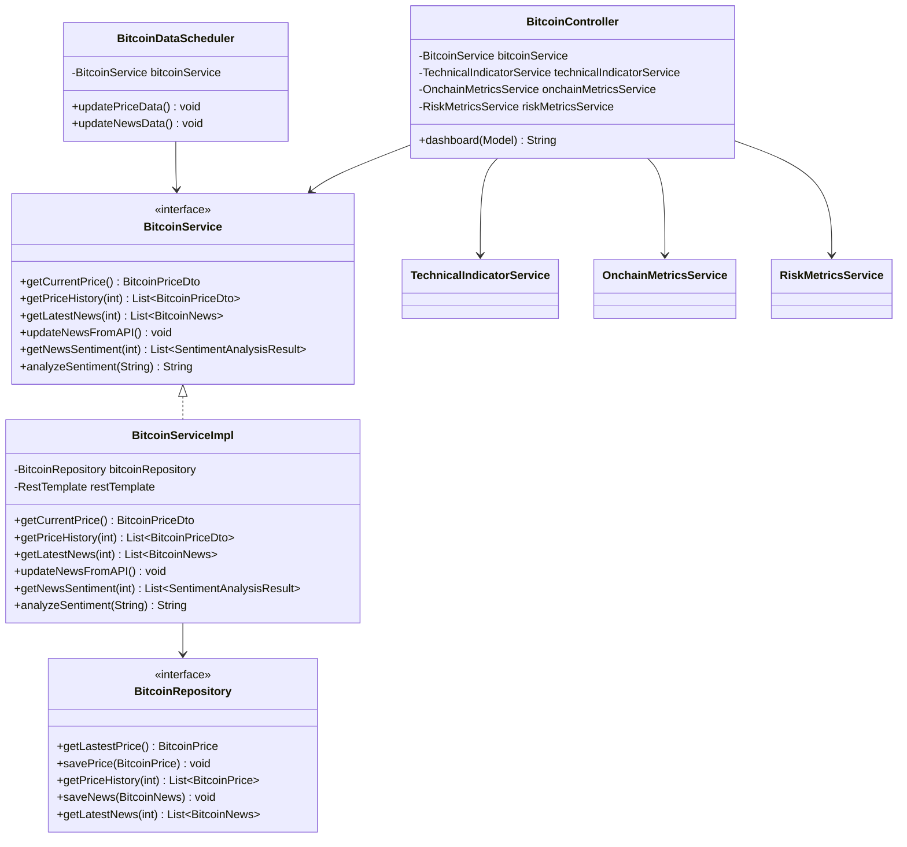

# 비트코인 정보 대시보드

이 프로젝트는 비트코인의 가격 정보, 기술적 지표, 뉴스 감성 분석, 온체인 데이터 등을 종합적으로 보여주는 대시보드 웹 애플리케이션입니다.

## 주요 기능

- **실시간 비트코인 가격 정보**: CoinGecko API를 통해 최신 비트코인 가격 및 24시간 변동률 제공
- **가격 추이 그래프**: 최근 30일간의 비트코인 가격 변화를 차트로 시각화
- **AI 기반 가격 예측**: 간단한 예측 알고리즘을 통한 향후 7일 가격 예측
- **뉴스 감성 분석**: 최신 비트코인 관련 뉴스를 수집하고 긍정/부정/중립으로 감성 분석
- **기술적 지표**: RSI, MACD, 볼린저 밴드, 이동평균선 등 주요 기술적 지표 제공
- **온체인 분석**: 블록체인 상의 월렛 활성화, 거래 수수료, 채굴 난이도, 해시레이트 정보 제공
- **리스크 지표**: 공포 탐욕 지수, 변동성, 시장 건전성 등 투자 리스크 관련 지표 제공

## 기술 스택

- **Java 17**
- **Spring Framework (Spring MVC)**
- **Tomcat 10**
- **MySQL 데이터베이스**
- **JSP, JSTL, TailwindCSS, Chart.js**
- **Docker, GitHub Actions**
- **외부 API**: CoinGecko, CryptoCompare, Blockchain.info, Alternative.me 등

## 프로젝트 구조

- **Controller**: 클라이언트 요청 처리 및 뷰 연결
- **Service**: 비즈니스 로직 및 외부 API 연동
- **Repository**: 데이터베이스 접근 및 CRUD 작업
- **Scheduler**: 주기적인 데이터 업데이트 작업
- **Model/DTO**: 데이터 모델 및 전송 객체
- **Filter**: 인코딩 관련 설정
- **Views**: JSP 기반 사용자 인터페이스

### 아키텍처 다이어그램

```mermaid
graph TD
    Client[사용자 브라우저] -->|HTTP 요청| Tomcat[Tomcat 서버]
    Tomcat -->|요청 전달| Filter[EncodingFilter]
    Filter -->|요청 처리| Controller[BitcoinController]
    
    Controller -->|데이터 요청| Services[서비스 계층]
    Services -->|데이터 조회/저장| Repository[비트코인 리포지토리]
    Repository -->|SQL 쿼리| Database[(MySQL DB)]
    
    Services -->|외부 API 호출| APIs[외부 API 서비스]
    APIs -->|가격 데이터| CoinGecko[CoinGecko API]
    APIs -->|뉴스 데이터| CryptoCompare[CryptoCompare API]
    APIs -->|온체인 데이터| Blockchain[Blockchain.info API]
    APIs -->|공포지수| FearGreed[Fear & Greed API]
    
    Scheduler[BitcoinDataScheduler] -->|주기적 실행| Services
    
    Controller -->|모델 데이터 전달| Views[JSP Views]
    Views -->|HTML 응답| Client
    
    subgraph 핵심 서비스
    BitcoinService[BitcoinService]
    TechnicalService[TechnicalIndicatorService]
    OnchainService[OnchainMetricsService]
    RiskService[RiskMetricsService]
    end
    
    Services --> 핵심 서비스
```

### 클래스 다이어그램



## 개발 환경 설정

### 필수 요구사항

- Java 17 이상
- Maven 3.8 이상
- MySQL 8.0 이상

### 환경 변수 설정

프로젝트 루트에 `.env` 파일을 생성하고 다음 변수를 설정해주세요:

```
DB_URL=jdbc:mysql://localhost:3306/bitcoin_dashboard
DB_USER=your_username
DB_PASSWORD=your_password
COINCOMPARE_API_KEY=your_api_key
```

### 데이터베이스 설정

`sql/bitcoin_tables.sql` 파일을 실행하여 필요한 테이블을 생성합니다.

## 배포

프로젝트는 Docker 컨테이너로 패키징되며, GitHub Actions를 통해 CI/CD 파이프라인이 구성되어 있습니다. `main` 브랜치에 변경 사항을 푸시하면 자동으로 GitHub Container Registry에 Docker 이미지가 빌드되고 푸시됩니다.

## Trouble Shooting

개발 과정에서 발생한 문제 해결 방법은 다음 링크에서 확인할 수 있습니다:
https://www.notion.so/nahyuneun/1c9195fb75e5809f98b0c0d9b3cb06fe?pvs=4